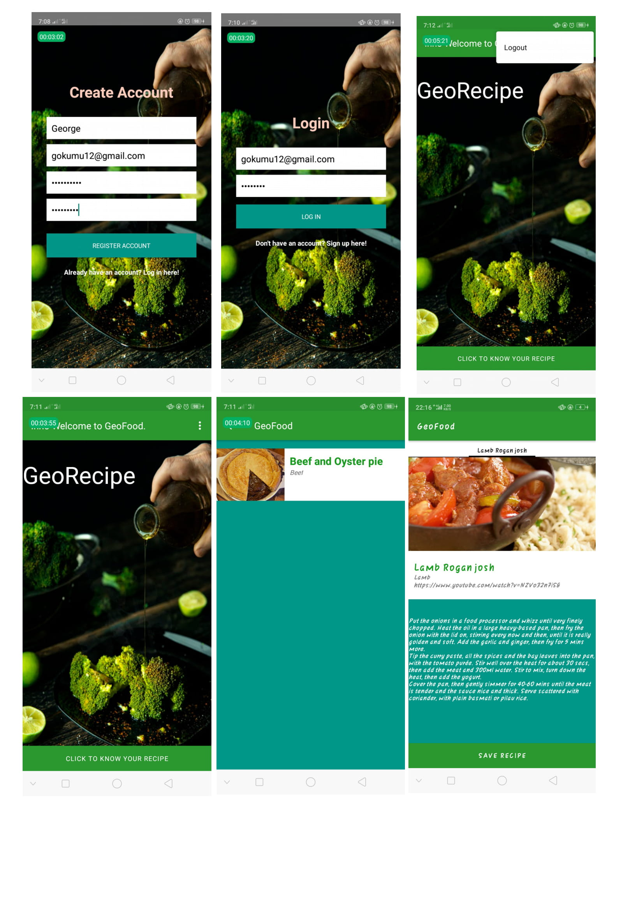

# GeoRecipe
 - Welcome to GeoRecipe app Where you get instructions of how to cook a delicious meal.

 ## Key Features Done
  - Register
  - Login
  - Enjoy the nice view of meal picture and instructions
  - Link to youtube.

    ## Live Demo
    

  ## Look out of the App
  

  ## Feauture MVP
  - Search Panel
  - Auto-lock screen feature  to allow users to cook without any distraction
  -  Step-by-Step instructions aligned Correctly
  - Liking Activity

  ## Kwown Bugs
  - The api gives only one random List at a time.

  ## Technologies Used.
  - Android Studio(You can download one here https://developer.android.com/studio)
  - MealDB random Meal API
  - Java Language
  - Firebase (Realtime database to store user credentials and saving data)
  - [Link on how to setup your Firebase](https://firebase.google.com/docs/android/setup)
  - Espresso 3.2.0 for testing
  - Robolectric 4.2.1 for testing
  - JUnit 4.12
  - Gradle

  ## Installation
  - Clone this repository and import into Android studio.
  - git clone here = https://github.com/George-Okumu/GeoFood.git
  - Enable gradle to import all the dependencies automatically
  - Make sure you have the technologies above
  - Make sure you have MealDb Api for Random Meal

  ## Maintainers
  - This project is maintained by George Okumu.
  - [For communication:] (gokumu12@gmail.com)

  ## Contributing
  - contributing for feature mvp and new ideas are highly welcomed
  - Git clone
  - Set the instructions/technologies required
  - Work and request for git merge .

  ## License
  - MIT license
  - Copyright @GeorgeOkumu2020.
